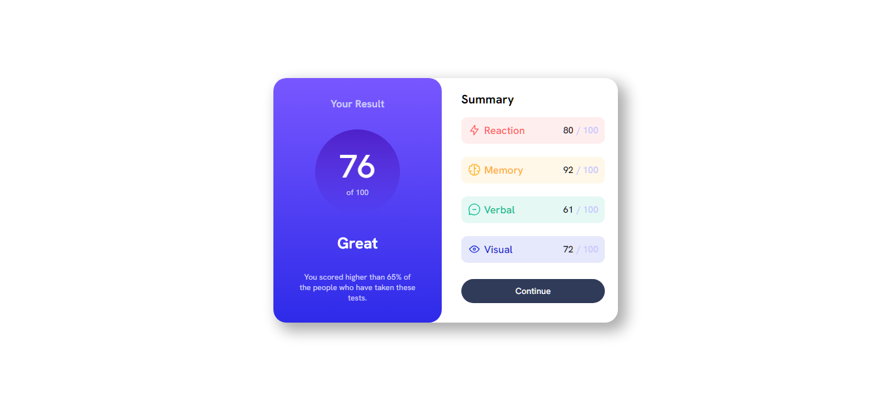

# Frontend Mentor - Results Summary Component Solution

This repository contains a solution to the [Results summary component challenge](https://www.frontendmentor.io/challenges/results-summary-component-CE_K6s0maV) on Frontend Mentor. This challenge focuses on building a results summary component that displays scores and categories based on a provided JSON dataset.

## Table of Contents

- [Overview](#overview)
  - [The Challenge](#the-challenge)
  - [Screenshot](#screenshot)
  - [Links](#links)
- [Features](#features)
- [Built With](#built-with)
- [Getting Started](#getting-started)
- [Usage](#usage)
- [Acknowledgments](#acknowledgments)
- [Contact](#contact)

## Overview

### The Challenge

The challenge was to create a responsive results summary component that showcases scores and categories based on local JSON data. The key requirements were:

- Display scores and categories in a visually appealing manner.
- Implement hover and focus states for interactive elements.
- Dynamically populate content using the provided JSON data.

### Screenshot



### Links

- Solution: [GitHub Repository](https://github.com/sliyarli/results-summary-component)
- Live Demo: [GitHub Pages](https://sliyarli.github.io/results-summary-component)

## Features

- Responsive layout for various screen sizes.
- Hover and focus states for interactive elements.
- Dynamic population of content using JSON data.

## Built With

- HTML5 and CSS3
- Flexbox for layout
- Fetch API for loading JSON data dynamically

## Getting Started

To get a local copy up and running, follow these steps:

1. Clone the repository to your local machine:

   ```bash
   git clone https://github.com/yourusername/results-summary-component.git
   ```

2. Navigate to the project directory:

   ```bash
   cd results-summary-component
   ```

3. Open the `index.html` file in your preferred web browser.

## Usage

You can use this project as a template to create similar summary components for displaying scores and categories dynamically. Modify the JSON data in `data.json` to match your desired content.

Feel free to customize the styles and structure to fit your design preferences.

## Acknowledgments

I'd like to acknowledge Frontend Mentor for providing this challenge, which is a great way to practice and improve front-end development skills.

## Contact

- GitHub: [yourusername](https://github.com/sliyarli)

Feel free to reach out if you have any questions or feedback about this project. Your input is highly appreciated!
